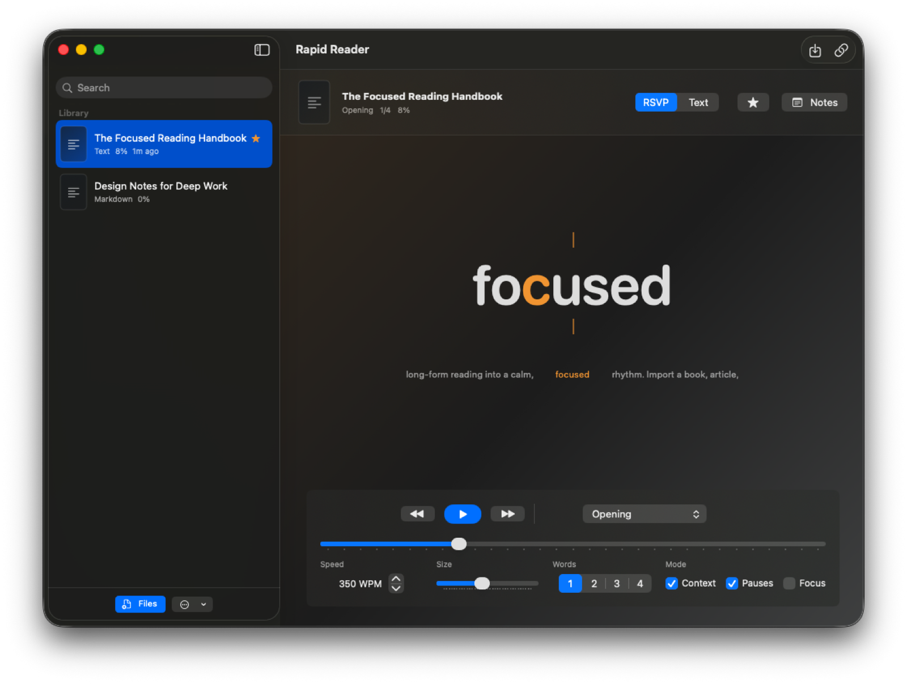

# Rapid Reader

Rapid Reader is a native macOS app for focused long-form reading. It combines rapid serial visual presentation (RSVP) with a normal full-text reader, so you can move quickly through books and articles while still being able to inspect the original text and resume from any word.



## Highlights

- Import EPUB, PDF, DOCX, RTF, HTML, Markdown, plain text, pasted text, and web articles.
- Keep a local library with reading progress, favorite documents, notes, preferences, sections, and EPUB cover art.
- Read in RSVP mode with pivot-letter highlighting, context preview, punctuation pauses, and adjustable chunk size.
- Switch to full-text mode whenever you want to browse normally, then click a word to resume from that exact position.
- Tune speed, font size, focus mode, section navigation, and playback controls from one compact reading surface.
- Recover gracefully from image-only EPUB cover pages and older library data.
- Store everything locally in `~/Library/Application Support/Rapid Reader`.


## Download

The latest DMG is attached to the GitHub release for this repository.

1. Download `RapidReader-<version>.dmg` from [Releases](https://github.com/Zer0codestuff/Rapid-Reader/releases).
2. Open the DMG.
3. Drag `Rapid Reader.app` into `Applications`.
4. Launch Rapid Reader.

The public DMG is ad-hoc signed for local distribution. If macOS blocks the first launch because the app is not notarized, open **System Settings -> Privacy & Security** and allow the app after your first launch attempt.

## Build From Source

Requirements:

- macOS 14 or newer
- Xcode command line tools
- Swift 6 compatible toolchain

Run the app:

```bash
./script/build_and_run.sh
```

Build the app bundle without launching:

```bash
./script/build_and_run.sh --build-only
```

Run tests:

```bash
swift test
```

Create a local DMG:

```bash
./script/package_dmg.sh 1.0.0
```

The packaged app is written to `dist/Rapid Reader.app`, and the DMG is written to `build/package/`.

## Keyboard And Reader Controls

- `Space`: play or pause RSVP playback.
- `Left Arrow` / `Right Arrow`: move backward or forward.
- `Command-O`: import files.
- Section picker: jump to a specific chapter or section.
- Text mode: click a word to set the resume position.

## Development Notes

Rapid Reader is implemented with SwiftUI and SwiftPM. The core import, parsing, text-processing, and persistence logic lives in `RapidReaderCore`, while the macOS UI target owns the reading surface, sidebar, app resources, and packaging entrypoints.

The project includes regression tests for:

- EPUB cover extraction.
- Image-only EPUB cover-page filtering.
- Library repair for older imported documents.
- Markdown section splitting.
- Reading progress and preference persistence.
- RSVP pivot-letter calculation.
