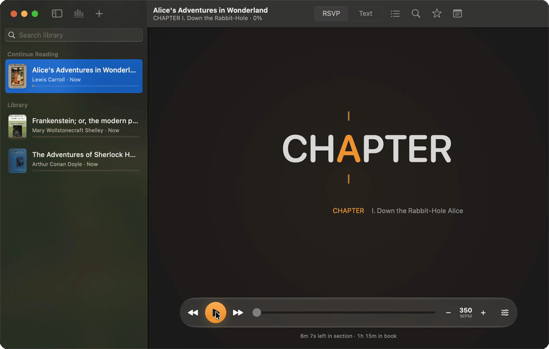
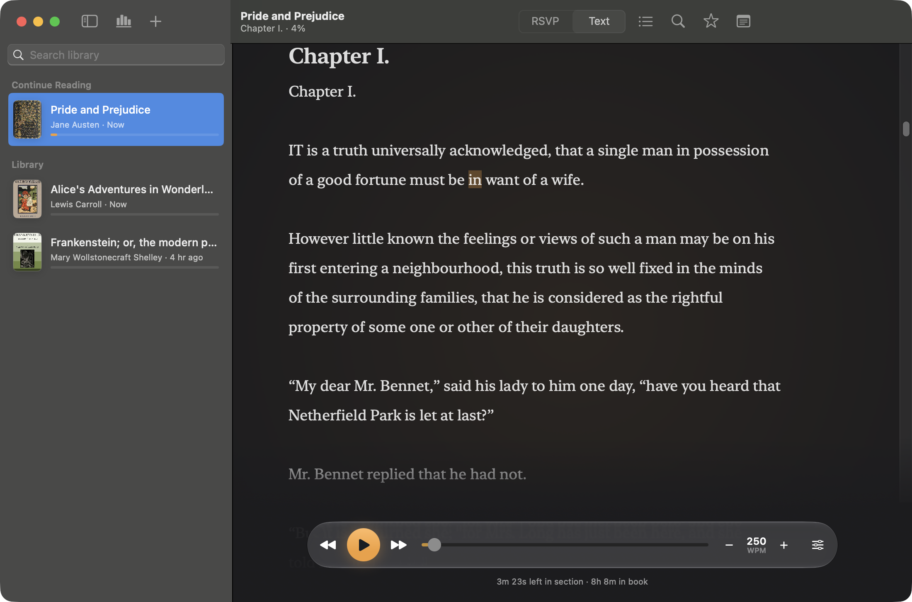

# Rapid Reader

Rapid Reader 2.0 is a free, open-source native macOS app for focused long-form reading, redesigned around a quiet stage, Liquid Glass controls, and a new focus-point icon. It combines rapid serial visual presentation (RSVP) with a normal full-text reader, so you can move quickly through books and articles while still being able to inspect the original text and resume from any word.



## Highlights

- Import EPUB, PDF, DOCX, RTF, HTML, Markdown, plain text, pasted text, and web articles.
- Keep a local library with reading progress, favorite documents, notes, preferences, sections, and EPUB cover art.
- Read in RSVP mode with pivot-letter highlighting, context preview, punctuation pauses, and adjustable chunk size.
- Switch to full-text mode whenever you want to browse normally, then click a word to resume from that exact position.
- Read on a quiet stage: a floating glass control bar (Liquid Glass on macOS 26 and later, a material fallback on macOS 14 and 15) that hides while you read and returns when the mouse moves. Arrow Up and Down change speed.
- Tune speed, font size, focus mode, section navigation, and playback controls from one compact reading surface.
- Recover gracefully from image-only EPUB cover pages and older library data.
- Search inside a document, choose a light, dark, or sepia reader, and review reading time and speed in Statistics.
- Store everything locally in `~/Library/Application Support/Rapid Reader`.



## Download

The browser version is available at [rapid-reader.up.railway.app](https://rapid-reader.up.railway.app). It supports local file imports, RSVP and text reading, notes, search, themes and statistics, with a separate library stored in your browser. No account or cloud sync is required. See [web/README.md](web/README.md) for browser setup, backup and offline reading.

The latest DMG is attached to the GitHub release for this repository.

1. Download `RapidReader-<version>.dmg` from [Releases](https://github.com/Zer0codestuff/Rapid-Reader/releases).
2. Open the DMG.
3. Drag `Rapid Reader.app` into `Applications`.
4. Launch Rapid Reader.

The DMG contains a universal app for Apple Silicon and Intel Macs. Unless a release says it is notarized, the app is ad-hoc signed: if macOS blocks the first launch, open **System Settings -> Privacy & Security** and allow the app after your first launch attempt.

## How It Compares

Rapid Reader supports reading on a Mac or in a browser, with local files and no account. Two established speed readers for comparison:

| | Rapid Reader | Outread | Spreeder |
| --- | --- | --- | --- |
| Platforms | macOS 14 or later, Web | iOS, iPadOS, macOS | Web, Mac, Windows, iOS, Android, Chrome OS |
| Price | Free | Commercial app | Commercial license, with a free web app |
| Open source | Yes, MIT | No | No |
| Imports | EPUB, PDF, DOCX, RTF, HTML, Markdown, plain text, pasted text, web articles | DRM-free EPUB, PDF, DOC, RTF, TXT, web articles | 52 file and ebook formats |
| Reading modes | RSVP and full text, with click-to-resume | RSVP and a guided highlighter | RSVP |

Outread and Spreeder also run on phones and tablets. Outread includes reading exercises, and Spreeder adds AI summaries and a cloud profile. Rapid Reader keeps its native library in a local folder and its web library in the browser, without those features.

Details for the other apps come from the [Outread](https://outreadapp.com/) and [Spreeder](https://www.spreeder.com/) websites, checked in October 2026.

## Build From Source

Requirements:

- macOS 14 or newer
- Xcode command line tools
- Swift 6 compatible toolchain

Run the app:

```bash
./script/build_and_run.sh
```

Build the app bundle without launching:

```bash
./script/build_and_run.sh --build-only
```

Run tests:

```bash
swift test
```

Create a universal release DMG (release configuration, arm64 and x86_64, version and build number in `Info.plist`):

```bash
./script/package_dmg.sh 2.0
```

The packaged app is written to `dist/Rapid Reader.app`, and the DMG is written to `build/package/`. `build_and_run.sh` accepts the same settings through `CONFIGURATION=release`, `UNIVERSAL=1`, `APP_VERSION`, and `BUILD_NUMBER`.

Optional signing and notarization, with credentials on the build Mac:

```bash
DEVELOPER_ID_APPLICATION="Developer ID Application: Name (TEAMID)" \
NOTARY_PROFILE=rapid-reader-notary \
./script/package_dmg.sh 2.0
```

`NOTARY_PROFILE` is a keychain profile created with `xcrun notarytool store-credentials`.

## Updates

Rapid Reader uses [Sparkle](https://sparkle-project.org) for updates. The updater and the **Check for Updates…** menu item are enabled only in builds made with `SPARKLE_PUBLIC_KEY`. The app reads `appcast.xml` from the latest GitHub release.

One-time setup by the owner:

1. Run `.build/artifacts/sparkle/Sparkle/bin/generate_keys` after `swift package resolve`. It stores the private key in the login keychain and prints the public key.
2. Export the private key with `generate_keys -x sparkle-private.key`, keep a backup offline, and add its contents as the `SPARKLE_PRIVATE_KEY` repository secret. Add the public key as the `SPARKLE_PUBLIC_KEY` repository variable.

Local release with updates:

```bash
SPARKLE_PUBLIC_KEY=<public key> ./script/package_dmg.sh 2.0
./script/make_appcast.sh 2.0   # uses the keychain key, or SPARKLE_PRIVATE_KEY_FILE
```

Upload the DMG and `build/appcast/appcast.xml` to the `v2.0` release. The tag workflow does this automatically when the secret and variable exist. Optional release notes go in `docs/release-notes/<version>.html`. Losing the private key means existing installs can no longer verify updates.

## Releases

Pushing a tag such as `v2.0` runs `.github/workflows/release.yml`, which tests, packages the DMG, and attaches it to a draft GitHub release for review. The workflow can also be started manually to build a DMG artifact without creating a release. CI signs ad-hoc; Developer ID signing and notarization currently run locally.

## Keyboard And Reader Controls

- `Space`: play or pause RSVP playback.
- `Left Arrow` / `Right Arrow`: move backward or forward.
- `Up Arrow` / `Down Arrow`: raise or lower the speed.
- `Command-,`: open Settings.
- `Command-O`: import files.
- `Command-F`: search in the current document.
- Section picker: jump to a specific chapter or section.
- Text mode: click a word to set the resume position.

## Development Notes

Rapid Reader is implemented with SwiftUI and SwiftPM. The core import, parsing, text-processing, and persistence logic lives in `RapidReaderCore`, while the macOS UI target owns the reading surface, sidebar, app resources, and packaging entrypoints.

The project includes regression tests for:

- EPUB cover extraction.
- Image-only EPUB cover-page filtering.
- Library repair for older imported documents.
- Markdown section splitting.
- Reading progress and preference persistence.
- RSVP pivot-letter calculation.

## License

Rapid Reader is released under the [MIT License](LICENSE). ZIPFoundation, SwiftSoup and Sparkle keep their own licenses.
